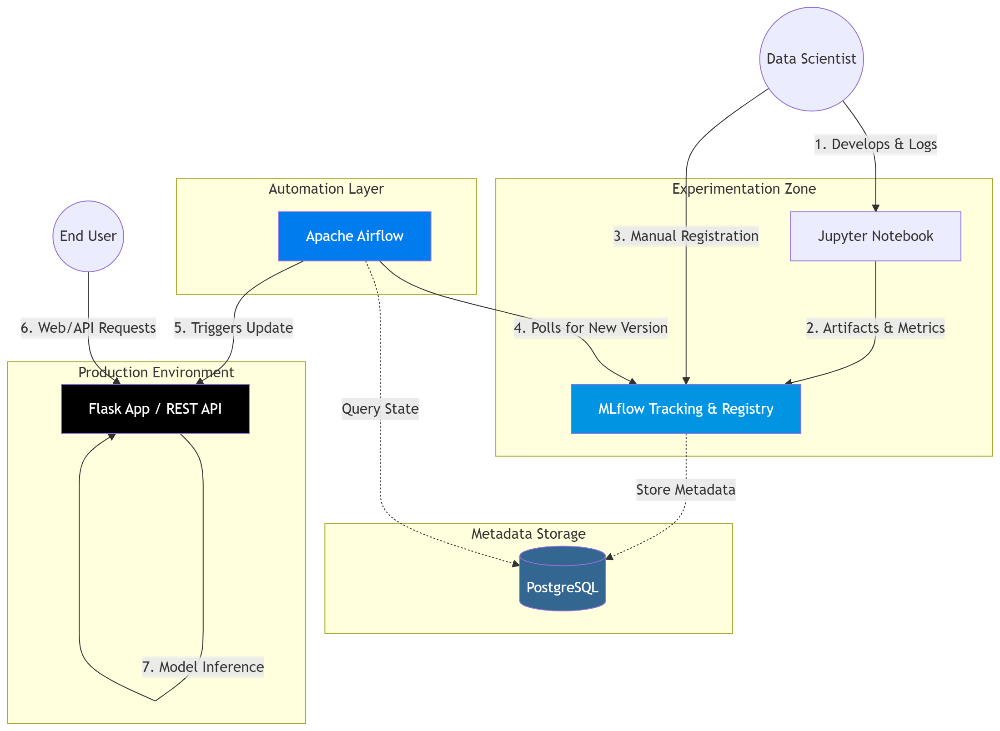

# ml-cluster

Build Status:

## Intro

The cluster integrates **PostgreSQL, MLflow, Apache AirFlow**, and a **Flask** application. PostgreSQL serves as the centralized metadata repository for both MLflow and AirFlow. The machine learning lifecycle begins in a Jupyter Notebook, where training scripts log results and artifacts to MLflow. Once a Data Scientist manually registers a model version within the MLflow Registry, an AirFlow DAG periodically polls for updates. Upon detecting a new version, AirFlow triggers the Flask server to transition the updated model into the production environment. The Flask backend functions as both a web server for HTML content and a RESTful API for executing model updates and predictions.

Features:

+ **Infrastructure as Code**: Rapidly provision or decommission clusters using **Terraform**.
+ **Parameterized charts**: optimal for flexible, environment-aware deployments, using **Helm Charts**.

## Demo Video

  

## Architecture

## Lessons learned

+ The `depends_on` meta-argument in Terraform is important in controlling the order of deloying resources in the cluster. Terraform tries to *parallelize* everything to speed up, which can lead to unintended consequences. It would be more predictable when manually controlling this process. See [here](terraform-helm/graph.svg).
+ In Terraform, in `helm.tf`, without using `timeout = 900`, it defaults to a standard 5-minute (300 seconds) wait, which may be too short. E.g. resource constraint. Terraform trusts the Kubernetes API for checking the Resources' Readiness. But when a Pod is ready, it doesn't mean the Application in the Pod is ready!
  + **Take-away**: explicitly use `timeout = 900` (or some number) in Helm Charts; additionally use `startupProbe` and `readinessProbe` in Helm Chart YAML file for e.g. `kind: Deployment`. Example: [here](terraform-helm/charts/airflow/templates/airflow.yaml).
+ File System Permission: When declaring `PersistentVolumeClaim`, the `securityContext:` (for a `Deployment`) is often as followed `runAsUser: 50000` (in case of AirFlow), `fsGroup: 0`. The latter means: *"I want to be added into this Group"*. What if the host who offers `PersistentVolume` allocates the folder with Root Group being unable to write in that folder? For example `drwxr-xr-x  2 root root`. Worse, for some reason, the host assigns a different Group (not Root Group). All this makes AirFlow unable to write its data, leading to the failure of Pod creation.
  + **Take-away**: Pre-allocate all folders needed for the Cluster (`PersistentVolume`) in advance, with appropriate Permissions (or just everyone-can-write Permission `sudo chmod -R a+rwx a_folder`).

## Reproducibility

Development Runtime: Ubuntu 24.04 (under Windows 11 WSL).

Data Scientist's machine: Windows 11 w. WSL2 & Chrome browser.

1. Install needed packages: `sudo apt update && sudo apt install -y git curl unzip ca-certificates`.
2. Install Python: `sudo apt install python3.12`
3. Install k3d: `curl -s https://raw.githubusercontent.com/k3d-io/k3d/main/install.sh | TAG=v5.8.3 bash`
4. Install Terraform: (follow this [guide](https://developer.hashicorp.com/terraform/tutorials/aws-get-started/install-cli))
5. Install Helm: `curl -fsSL https://raw.githubusercontent.com/helm/helm/main/scripts/get-helm-4 | bash -s -- --version v4.1.1`
6. Install Kubectl: `curl -LO "https://dl.k8s.io/release/v1.35.2/bin/linux/amd64/kubectl"`
  + `chmod +x kubectl`
  + `mv kubectl /usr/local/bin/`
7. Install Docker. If on Windows, use Docker for Windows.
8. Modify the hosts file (Windows): `C:\Windows\System32\drivers\etc\hosts`
  + `127.0.0.1 mlflow.local`
  + `127.0.0.1 airflow.local`
  + `127.0.0.1 mlapp.local`
9. Set environment variables.
  + `TF_VAR_airflow_fernet_key`: Generate as in [here](https://airflow.apache.org/docs/apache-airflow/stable/security/secrets/fernet.html).
  + `TF_VAR_password`: Password for Postgres.
  + `TF_VAR_username`: Username for Postgres.
10. Preallocate folder `/var/lib/demo-cluster-data` with Full-Permission for everyone.
  + Child folder: `./airflow/dags-data` with file `deploy_model_if_newer.py` ([link](airflow/dags-data/deploy_model_if_newer.py)) ➔ DAG file for AirFlow.
  + Child folder: `ml_app` with file `ml_app.py` and folder `templates` ([link](ml_app))
11. Download the Github Repo `ml-cluster`.
12. Move to the folder `terraform-helm` folder within. Type: `terraform init`, then `terraform apply -auto-approve`.
13. Check health status of the Cluster:
  + `kubectl wait --for=condition=Ready nodes --all --timeout=300s`: wait for **Nodes**.
  + `kubectl wait --for=condition=Ready pods --all -A --field-selector=status.phase=Running --timeout=300s`: wait for **Pods**.
  + `kubectl wait --for=condition=available --all deployments -A --timeout=300s`: wait for **Deployments**.
14. Start Chrome browser and visit `http://mlflow.local` to assign a Model as Registered Model (name: `Wine_Quality_Analysis_BestEstimator` and alias `champion`). As soon as such Model is available, AirFlow will carry out a Task that asks Flask to update the Model in itself. The Prediction Website is at `http://mlapp.local`.
  + If using Jupyter Notebook, connect to Mlflow via `mlflow.set_tracking_uri("http://mlflow.local")`.
15. Destroy the Cluster, using the command `terraform destroy -auto-approve`. Double check with `k3d cluster list` (`demo-cluster` still in there?).

## Development Environment

+ Windows 11 24H2 (WSL2 (Ubuntu 24.04)) x64
+ Python 3.12.7
+ k3d: v5.8.3 (based on k8/k3s: v1.31.5+k3s1)
+ Terraform: 1.14.6
+ Helm: 4.1.1
+ kubectl: v1.35.2
+ Postgres: 15-alpine (Docker Image)

## Future Works

+ `k3d` is a local Kubernetes. Think of AWS EKS (https://aws.amazon.com/eks/) or Google GKE (https://cloud.google.com/kubernetes-engine), or Azure AKS (https://azure.microsoft.com/en-us/products/kubernetes-service).
  + In Terraform, the `main.tf` should change to certain Providers.
